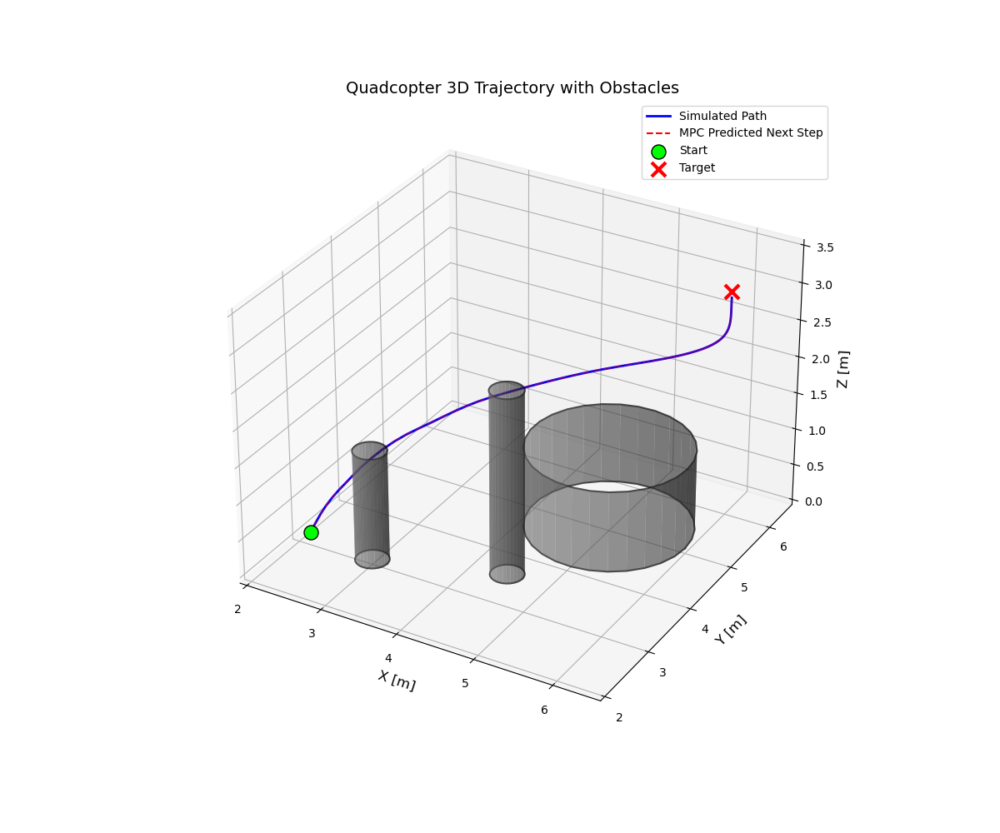
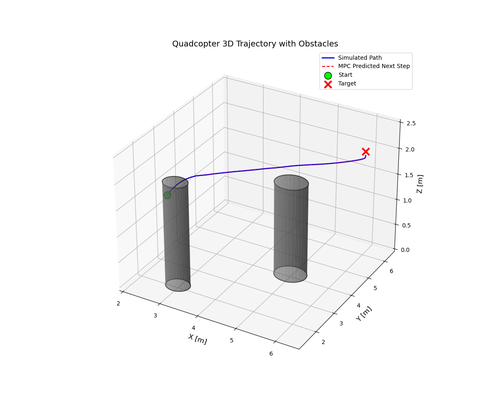
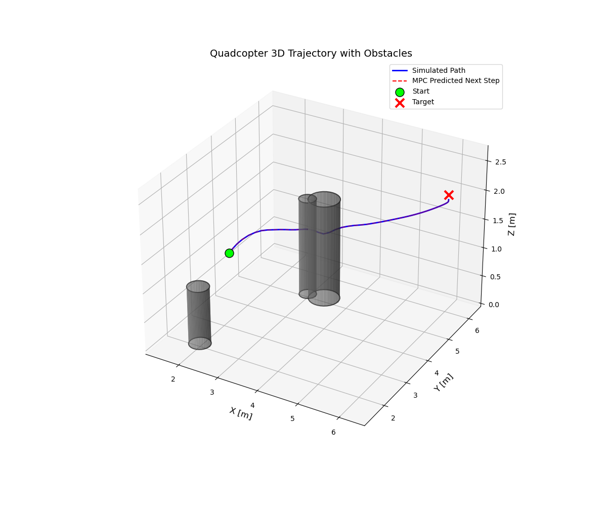
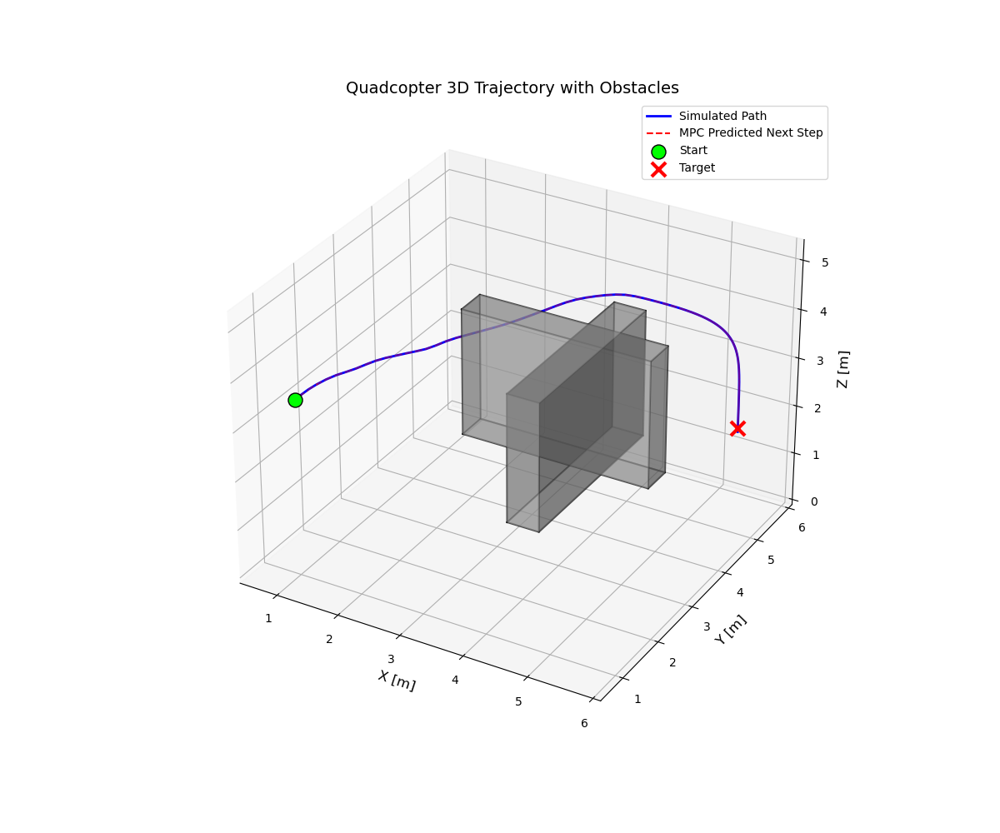

# Quadcopter Model Predictive Control (MPC)



## Table of Contents

- [Quadcopter Model](#quadcopter-model)
  - [Introduction](#introduction)
  - [Problem Statement](#problem-statement)
    - [System Description](#system-description)
    - [Quadcopter System Dynamics](#quadcopter-system-dynamics)
      - [1. State Definitions](#1-state-definitions)
      - [2. Force–Moment Mapping](#2-force–moment-mapping)
      - [3. Position Kinematics](#3-position-kinematics)
      - [4. Translational Dynamics](#4-translational-dynamics)
      - [5. Euler Angle Rates](#5-euler-angle-rates)
      - [6. Rotational Dynamics](#6-rotational-dynamics)
  - [MPC Formulation as an NLP](#mpc-formulation)
    - [Objective Function](#objective-function)
    - [Constraints](#constraints)
  - [Assumptions](#assumptions)
  - [Transformation to NLP](#transformation-to-nlp)
  - [Pseudo Code](#pseudo-code)
  - [Simulation and Control Parameters](#simulation-and-control-parameters)
  - [Usage](#usage)
  - [Output](#output)


<!-- # Quadcopter model -->


## Introduction

This repository implements a **multiple shooting**, point-to-point Model Predictive Control (MPC) scheme for a quadcopter navigating in a 3D environment with static circular obstacles. Using CasADi for symbolic modeling and IPOPT as the nonlinear programming (NLP) solver, the controller computes optimal thrust inputs over a finite horizon to guide the vehicle from an initial to a target state while avoiding collisions.

## Problem Statement

We seek to design an MPC that steers a quadcopter from a starting pose to a desired target pose, subject to dynamics constraints and obstacle avoidance. The controller solves a finite-horizon optimal control problem in real time.

### System Description

- **States (12):** Cartesian position `(x, y, z)`, Euler angles `(phi, theta, psi)`, world-frame velocities `(vx, vy, vz)`, and body-frame angular rates `(p, q, r)`.
- **Controls (4):** Thrusts `T1, T2, T3, T4` produced by each rotor.
- **Environment:** Static circular obstacles in the horizontal plane, each defined by center `(cx, cy)` and radius `r`.


### Quadcopter System Dynamics


The continuous-time dynamics define the right-hand-side (RHS) of the system: **ẋ = f(x, u)**, where:

#### 1. State Definitions

- **States (12 total)**:  
  `s = [x, y, z, u, v, w, phi, theta, psi, p, q, r]ᵀ`
  - `(x, y, z)`: position in inertial frame
  - `(u, v, w)`: linear velocities in body frame
  - `(phi, theta, psi)`: roll, pitch, yaw (Euler angles)
  - `(p, q, r)`: angular rates

- **Control actions (4)**:  
  `a = [a1, a2, a3, a4]ᵀ`  
  Each `ai` is the thrust produced by rotor i.

#### 2. Force–Moment Mapping

From rotor thrusts to aggregate forces/moments:

- Total thrust/throttle: `f1 = a1 + a2 + a3 + a4`
- Roll moment (x-axis): `f2 = a3 + a2 - a1 - a4`
- Pitch moment (y-axis): `f3 = a4 + a3 - a1 - a2`
- Yaw moment (z-axis): `f4 = a1 - a2 + a3 - a4`
- Drag-torque coefficient: `Kd = 0.008`

#### 3. Position Kinematics

$$ \dot{x} = u  $$
$$ \dot{y} = v  $$
$$\dot{z} = w $$

#### 4. Translational Dynamics

$$ \dot{u} = \frac{1}{m} (\cos \phi \sin \theta \cos\psi + \sin\phi \sin\psi) f1 $$ 
$$ \dot{v} = \frac{1}{m} (\cos\phi \sin\theta \sin\psi - \sin\phi \cos\psi) f1 $$
$$ \dot{w} = \frac{1}{m} (\cos\phi \cos\theta)  f1 - g $$

#### 5. Euler Angle Rates

$$ \dot{\phi} = p$$
$$ \dot{\theta} = q $$
$$ \dot{\psi} = r $$


#### 6. Rotational Dynamics

$$\dot{p} = \frac{Iy - Iz}{Ix} qr + \frac{l_1}{Ix}f_2$$

$$\dot{q} = \frac{Iz - Ix}{Iy}pr + \frac{l_2}{Iy}f_3$$

$$\dot{r} = \frac{Ix - Iy}{Iz}pq + \frac{Kd}{Iz}f_4$$


These equations are wrapped in a CasADi function `f(s, a)` and integrated using Runge–Kutta (RK4) with sampling time `T = 0.1 s`.


## MPC Formulation

We use a multiple shooting formulation over horizon `N` with sampling interval `delta_t`. At each step, we solve:

### Objective Function

The stage cost `l(s_k, a_k, s_r)` and terminal cost `l_f(s_N, s_r)` are defined as:

$$l(s_k, a_k, s_r) = (s_k - s_r)ᵀ Q (s_k - s_r) + a_kᵀ R a_k$$

$$l_f(s_N, s_r) = (s_N - s_r)ᵀ Q_f (s_N - s_r)$$

The total cost J is:

$$min_{{a_k}^{N-1}, {{s_k}^N}} J = Σ_{k=0}^{N-1} l(s_k, a_k, s_r) + l_f(s_N, s_r)$$


where:

- `s_r` is the target state
- `Q` and `R` are diagonal weight matrices for states and controls

### Constraints

Subject to constaints:

1. **Dynamics (multiple shooting):**

   ```
   s(k+1) = f_RK4(s(k), a(k), delta_t),  for k = 0 to N-1
   ```

2. **Initial condition:**

   ```
   s(0) = s0
   ```

3. **Control bounds:**

   ```
   a_min <= a(k) <= a_max,  for k = 0 to N-1
   ```

4. **State bounds:**

   ```
   s(k) ∈ X,  for k = 0 to N
   ```

5. **Obstacle avoidance:** for each obstacle center `(cx, cy)`, radius `r`, and maximum height `z`,

   ```
   (s_1(k) - cx)^2 + (s_2(k) - cy)^2 -S(s_3,z)*(r + buffer)^2 > =0,  for k = 1 to N
   ```
where `S(·)` is a sigmoid function that deactivates the constraint if the quadcopter is above the cylinder.
Solver: IPOPT with custom tolerances and maximum iterations.

 **Wall (Box) Obstacles**:  
A smooth penalty function `smooth_box_cost_casadi` is used to define the feasible region.  
The constraint is formulated as:
```
C_wall(s_1,s_2,s_3) >=0
```
where `C_wall` is designed to be positive outside the buffered wall and negative inside.  
## Assumptions

- Rigid-body dynamics; neglect aerodynamic drag
- The thrusts will be converted to motor torques by a low level controller.
- Perfect state measurement without noise
- Control inputs held constant over each sampling interval
- Obstacles are static vertical cylinders 

## Transformation to NLP

The NMPC problem is transformed into a standard nonlinear programming (NLP) problem of the form:

$$
\begin{aligned}
&\min_{W} \quad F(W) \\\\
&\text{subject to:} \\\\
&\quad G_{\text{eq}}(W) = 0 \quad \text{(equality constraints)} \\\\
&\quad G_{\text{ineq}}(W) \geq 0 \quad \text{(inequality constraints)} \\\\
&\quad W_{\min} \leq W \leq W_{\max} \quad \text{(box constraints)}
\end{aligned}
$$

This is achieved as follows:

**Decision Variables (W):**  
   The NLP decision variables are a stacked vector of all control inputs and states over the prediction horizon:

   W = [a₀ᵀ, a₁ᵀ, ..., a_{N-1}ᵀ, s₀ᵀ, s₁ᵀ, ..., s_Nᵀ]

   The initial condition and dynamics form the equality constraints, while the obstacles contribute to inequality constraint.

## Pseudo Code

```
// --- Setup ---
Initialize simulation_time = 0
Define simulation_end_time (T_end)
Define plant_integration_timestep (dt_plant, e.g., 0.01s for high-rate RK4)
Define mpc_solve_interval (dt_mpc, e.g., 0.1s, matching MPC's T)
Define last_mpc_run_time = -mpc_solve_interval // Ensure MPC runs on first step

// Initialize the Quadcopter Plant (actual model)
plant_current_state = Set_Initial_Quadcopter_State() // e.g., at origin, at rest
Define target_state_for_mpc

// Initialize the MPC Controller
quadcopter_mpc_controller = Create_QuadcopterMPC_Object(mpc_sampling_time = dt_mpc, scenario_id = desired_scenario)
Call quadcopter_mpc_controller.mpc_initialize() // This sets up the NLP problem structure

// Data Logging
Initialize empty lists for: logged_times, logged_plant_states, logged_applied_controls, logged_mpc_predictions

// Optional: Initial guess for MPC solver (can be updated for warm starts)
mpc_warm_start_solution = NULL

// --- Main Simulation Loop ---
WHILE simulation_time < simulation_end_time:

    // Check if it's time to run the MPC to get a new optimal control plan
    IF simulation_time >= last_mpc_run_time + mpc_solve_interval:
        // 1. Measure/Get current state of the plant
        current_measured_state_x0 = plant_current_state

        // 2. Solve the NLP to get optimal control and state sequences
        //    This calls the 'run_once' method of the controller
        Optimal_U_sequence, Optimal_X_sequence, mpc_warm_start_solution = \
            quadcopter_mpc_controller.run_once(
                current_state_actual = current_measured_state_x0,
                target_state_desired = target_state_for_mpc,
                initial_guess_for_W = mpc_warm_start_solution // Use previous solution for warm start
            )

        // 3. Extract the first optimal control input to apply to the plant
        control_to_apply_u0 = Optimal_U_sequence[:, 0] // First column is u(0)

        // Update time for next MPC run
        last_mpc_run_time = simulation_time

        // Log MPC predictions (optional)
        Add Optimal_X_sequence to logged_mpc_predictions
    END IF

    // 4. Apply the chosen control_to_apply_u0 to the plant
    //    (This control is held constant until the next MPC step updates it)

    // 5. Propagate Plant Dynamics (Simulate the actual quadcopter)
    //    Use a numerical integrator (e.g., RK4) with the plant_integration_timestep
    plant_state_derivative = quadcopter_mpc_controller.f_dynamics(plant_current_state, control_to_apply_u0)
    plant_next_state = Integrate_Dynamics_RK4(plant_current_state, control_to_apply_u0, plant_state_derivative, dt_plant, quadcopter_mpc_controller.f_dynamics)
    plant_current_state = plant_next_state

    // 6. Log Data
    Add simulation_time to logged_times
    Add plant_current_state to logged_plant_states
    Add control_to_apply_u0 to logged_applied_controls

    // Advance simulation time
    simulation_time = simulation_time + dt_plant

END WHILE

// --- Post-Simulation ---
Plot_Results(logged_times, logged_plant_states, logged_applied_controls, logged_mpc_predictions, target_state_for_mpc, obstacles_from_scenario)
Display "Simulation Ended".

```

## Simulation and Control Parameters

| Parameter                | Symbol       | Value                   |
| ------------------------|--------------|-------------------------|
| Prediction horizon       | N            | 20                      |
| MPC sampling time        | delta_t      | 0.1 s (configurable)    |
| Plant integration dt     | Delta_t      | 0.01 s                  |
| Mass                     | m            | 0.5 kg                  |
| Gravity                  | g            | 9.81 m/s²               |
| Inertia Ix, Iy           | —            | 2.32e-3 kg·m² each      |
| Inertia Iz               | —            | 4.00e-3 kg·m²           |
| Arm length               | L_arm        | 0.25 m                  |
| Yaw coefficient          | c_yaw        | 0.01                    |
| State weight Q           | —            | diag([20]*12)           |
| Control weight R         | —            | diag([3]*4)             |
| Terminal weight Qf       | —            | diag([100, 200, 2, 0.5, ...]) |
| Thrust bounds            | T_i          | [0, 15] N               |
| Obstacles                | —            | 5 cylinders in XY-plane |

## Usage

1. Install dependencies:

   ```bash
   pip install casadi numpy matplotlib simpy
   ```

2. Run the simulation script:

   ```bash
   python your_script.py
   ```

3. Adjust initial/target states, sampling times, or MPC weights in `__main__`.

## Output

- **Console logs:** Progress every 10 MPC steps; warnings on sampling mismatch.
- **Plots:**
  - 3D trajectory with actual path, MPC one-step predictions, start/target, and obstacles
  - Time-series of all 12 states comparing simulated vs. predicted next-step values

---

Enjoy experimenting with quadcopter MPC!
